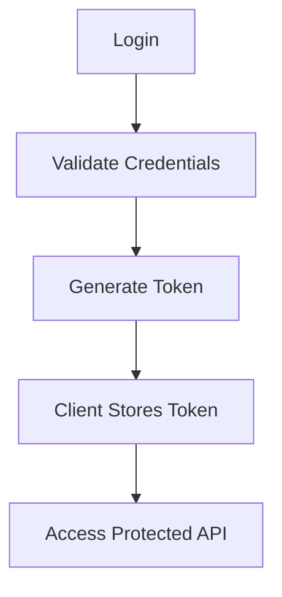
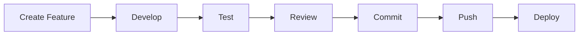

<div align="center">

# 🚀 Management System

**Aplikasi web modern untuk mengelola data administrasi secara terstruktur, dibangun dengan Laravel.**

<p>
  
  
  
  
</p>

<p>
  
  
  
  
</p>

<br/>

<p>
  <a href="#-tentang-project">Tentang</a> •
  <a href="#-fitur-utama">Fitur</a> •
  <a href="#️-tech-stack">Tech Stack</a> •
  <a href="#-instalasi">Instalasi</a> •
  <a href="#-api--auth">API</a> •
  <a href="#-dashboard-preview">Dashboard</a> •
  <a href="#-roadmap">Roadmap</a>
</p>

</div>

---

## 📌 Tentang Project

**Management System** adalah aplikasi berbasis web untuk mengelola data administrasi dalam satu sistem terpusat — mencakup dashboard administrator, manajemen pengguna, data jurusan, kelas, sekretaris, hingga statistik untuk monitoring data.

Project ini dikembangkan sebagai sarana pembelajaran dan eksplorasi dalam:

<table>
<tr>
<td width="50%" valign="top">

- 🌐 Web Development
- ⚙️ Backend Development
- 🗄️ Database Management

</td>
<td width="50%" valign="top">

- 🔌 REST API
- 🔐 Authentication & Authorization
- 📊 Dashboard Development

</td>
</tr>
</table>

---

## ✨ Fitur Utama

<details open>
<summary><b>👤 User Management</b></summary>
<br/>

| Fitur | Deskripsi |
|---|---|
| 🔑 Authentication & Login | Sistem login dengan validasi kredensial |
| 👥 Pengelolaan Pengguna | CRUD data pengguna secara terstruktur |
| 🛡️ Role-based Access | Akses dibedakan berdasarkan peran pengguna |
| 🔒 Protected Routes & API | Endpoint dan halaman terlindungi middleware |
| 📋 Manajemen Akun Sekretaris | Kelola akun khusus sekretaris |

</details>

<details>
<summary><b>🏫 Academic Management</b></summary>
<br/>

| Fitur | Deskripsi |
|---|---|
| 🏢 Data Jurusan | Pengelolaan data jurusan |
| 🏷️ Data Kelas | Pengelolaan data kelas |
| 🧑‍💼 Data Sekretaris | Pengelolaan data sekretaris |
| 🔗 Relasi Antar Data | Data jurusan, kelas, dan sekretaris saling terhubung |
| 📈 Statistik Akademik | Ringkasan data akademik secara real-time |

</details>

<details>
<summary><b>📊 Admin Dashboard</b></summary>
<br/>

- Total pengguna, jurusan, kelas, dan sekretaris
- Statistik aktivitas sistem
- Tabel data pengguna interaktif
- Tampilan **responsive** di semua perangkat
- **Dark mode** 🌙

</details>

<details>
<summary><b>🔐 Security</b></summary>
<br/>

- Authentication middleware
- Role-based authorization
- Bearer token authentication
- Protected API endpoints
- CSRF protection
- Input validation
- Database constraints

</details>

---

## 🛠️ Tech Stack

<div align="center">

| Layer | Teknologi |
|:---:|:---:|
| **Backend** |   |
| **Database** |  |
| **Frontend** |     |
| **Visualisasi** |  |
| **Auth** |  |
| **Build Tools** |   |

</div>

---

## 🏗️ Struktur Project

```text
management-system/
│
├── app/
│   ├── Http/
│   │   ├── Controllers/
│   │   │   ├── Api/
│   │   │   └── ...
│   │   └── Middleware/
│   │
│   ├── Models/
│   └── Providers/
│
├── database/
│   ├── migrations/
│   ├── seeders/
│   └── factories/
│
├── public/
│   ├── css/
│   ├── js/
│   └── images/
│
├── resources/
│   ├── css/
│   ├── js/
│   └── views/
|        ├── admin
|        └── sekretaris
│
├── routes/
│   ├── api.php
│   ├── web.php
│   └── ...
│
├── storage/
├── tests/
│
├── .env.example
├── artisan
├── composer.json
├── package.json
└── README.md
```

---

## ⚙️ Requirements

Pastikan environment memenuhi kebutuhan berikut sebelum instalasi:

| Requirement | Versi Minimum |
|---|---|
| PHP | 8.5.9 |
| Laravel | 13 |
| MySQL | 8.0+ |
| Composer | Terbaru |
| Node.js & npm | Terbaru |
| Git | Terbaru |

Cek versi yang terpasang:

```bash
php -v
composer -V
node -v
npm -v
```

---

## 🚀 Instalasi

<details open>
<summary><b>1️⃣ Clone Repository</b></summary>

```bash
git clone https://github.com/USERNAME/management-system.git
cd management-system
```

</details>

<details open>
<summary><b>2️⃣ Install Dependencies</b></summary>

```bash
composer install
```

</details>

<details open>
<summary><b>3️⃣ Setup Environment</b></summary>

Copy `.env.example` menjadi `.env`:

```bash
cp .env.example .env        # Linux/Mac
copy .env.example .env      # Windows
```

Sesuaikan konfigurasi database pada `.env`:

```env
APP_NAME="Management System"
APP_ENV=local
APP_DEBUG=true

DB_CONNECTION=mysql
DB_HOST=127.0.0.1
DB_PORT=3306
DB_DATABASE=(database pribadi)
DB_USERNAME=root
DB_PASSWORD=(password pribadi)
```

</details>

<details open>
<summary><b>4️⃣ Generate Application Key</b></summary>

```bash
php artisan key:generate
```

</details>

<details open>
<summary><b>5️⃣ Migration & Seeder</b></summary>

```bash
php artisan migrate

# Jika tersedia seeder
php artisan db:seed

# Atau sekaligus
php artisan migrate --seed
```

</details>

<details open>
<summary><b>6️⃣ Jalankan Server</b></summary>

```bash
php artisan serve
```

Buka di browser:

```text
http://127.0.0.1:8000
```

</details>

---

## 🔌 API & Auth

### Endpoint

```http
GET    /api/...
POST   /api/...
PUT    /api/...
DELETE /api/...
```

Endpoint tertentu membutuhkan autentikasi via **Bearer Token**:

```http
Authorization: Bearer YOUR_TOKEN
Accept: application/json
```

### Alur Autentikasi (Laravel Sanctum)



> Endpoint yang membutuhkan autentikasi dilindungi menggunakan middleware.

---

## 📊 Dashboard Preview

<div align="center">

| 🏢 Jurusan | 🏷️ Kelas | 🧑‍💼 Sekretaris |
|:---:|:---:|:---:|
| **8** | **48** | **48** |

</div>

```text
┌──────────────────────────────────────┐
│           ADMIN DASHBOARD             │
├────────────┬────────────┬─────────────┤
│  Jurusan   │   Kelas    │ Sekretaris  │
│     8      │     48     │     48      │
├────────────┴────────────┴─────────────┤
│           Activity Statistics          │
├─────────────────────────────────────── ┤
│            User Management             │
└──────────────────────────────────────┘
```

---

## 🧪 Testing

```bash
php artisan test
# atau
vendor/bin/phpunit
```

---

## 🧹 Perintah Berguna

<details>
<summary>Klik untuk lihat daftar perintah</summary>

| Perintah | Fungsi |
|---|---|
| `php artisan optimize:clear` | Membersihkan cache Laravel |
| `php artisan route:list` | Menampilkan daftar route |
| `php artisan db:show` | Melihat info database |
| `php artisan migrate` | Menjalankan migration |
| `php artisan migrate:fresh --seed` | Reset database (⚠️ hanya untuk development) |

</details>

---

## 🔄 Development Workflow



---

## 🌱 Branch Strategy

```text
main
│
├── development
│
├── feature/dashboard
├── feature/user-management
├── feature/academic-management
└── fix/api-statistics
```

```bash
git checkout -b feature/dashboard
git push -u origin feature/dashboard
```

---

## 📝 Commit Convention

| Prefix | Penggunaan |
|---|---|
| `feat:` | Menambahkan fitur |
| `fix:` | Memperbaiki bug |
| `refactor:` | Perubahan struktur kode |
| `docs:` | Dokumentasi |
| `style:` | Perubahan styling |
| `test:` | Menambahkan/memperbaiki test |
| `chore:` | Maintenance |

```bash
git commit -m "feat: add admin statistics"
git commit -m "fix: update dashboard statistics"
git commit -m "docs: update README"
```

---

## 📈 Status Project

<div align="center">

🚧 **Currently in Development**

*Beberapa fitur masih dalam tahap pengembangan dan dapat mengalami perubahan pada struktur database, API, maupun tampilan.*

</div>

---

## 🎯 Roadmap

- [ ] Improved dashboard analytics
- [ ] Advanced user management
- [ ] More detailed activity logs
- [ ] Export data
- [ ] Advanced reporting
- [ ] API documentation
- [ ] Improved authorization system
- [ ] Production deployment

---

## 👨‍💻 Developer

<div align="center">

**Andika Satrio Permana, Hibban Ahmad Ibrahim, Prince Muhammad Alfareza**

*Built with Laravel, PHP, and a lot of debugging.* ☕💻

</div>

---

## 📄 License

Project ini dikembangkan untuk **tujuan pembelajaran dan pengembangan diri**.

---

<div align="center">

### ⭐ Management System

*Built with Laravel 13 & PHP 8.5.9*

</div>